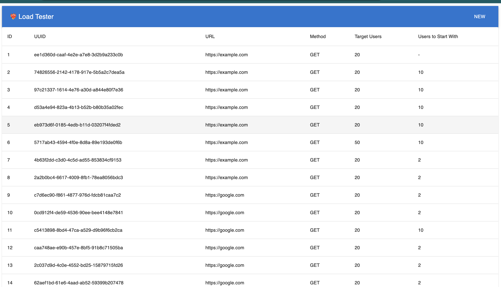
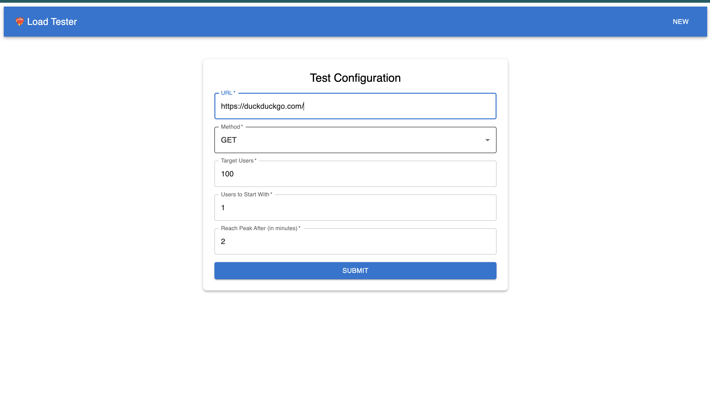
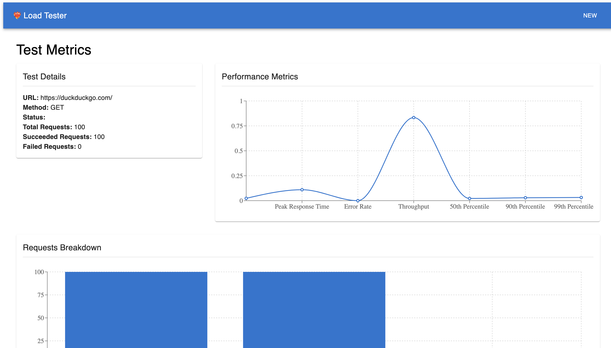
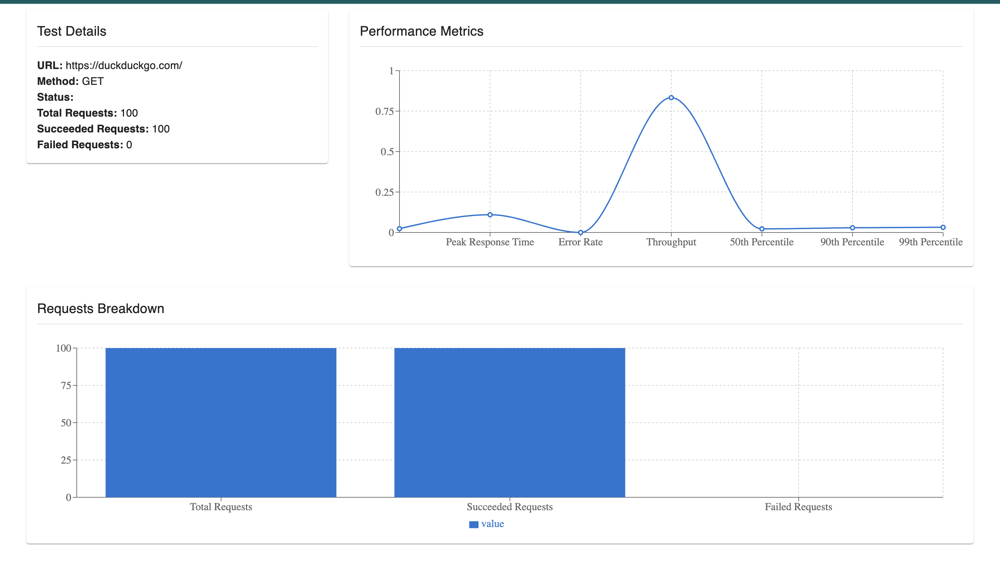

# Load Tester

The Load Tester is a Go-based application for stress testing and benchmarking HTTP APIs. It simulates multiple users making HTTP requests to evaluate the performance, reliability, and scalability of a system under different levels of load.

## Features

- **Configurable Load**: Set the number of target users, ramp-up duration, and initial users.
- **Flexible Requests**: Supports various HTTP methods, request bodies, and custom headers.
- **Real-time Updates**: Tracks and reports progress using a `liveupdate.Updater`.
- **Database Integration**: Optionally stores test results in a database using GORM.
- **Detailed Metrics**:
  - Average response time
  - Peak response time
  - Throughput
  - Error rate
  - Percentile response times (P50, P90, P99)

## Metrics Report

The test generates a detailed report with the following metrics:

- **Average Response Time**: Average time taken for requests.
- **Peak Response Time**: Maximum time taken for a request.
- **Throughput**: Requests per second.
- **Error Rate**: Ratio of failed requests to total requests.
- **Percentiles**: Response time percentiles (P50, P90, P99).

---

# Screenshots

## List all tests

---
## Intial page

--- 
## Real-time Stats

---

## Report

## Contributing

1. Fork the repository.
2. Create a feature branch.
3. Commit your changes.
4. Push and create a pull request.

---
